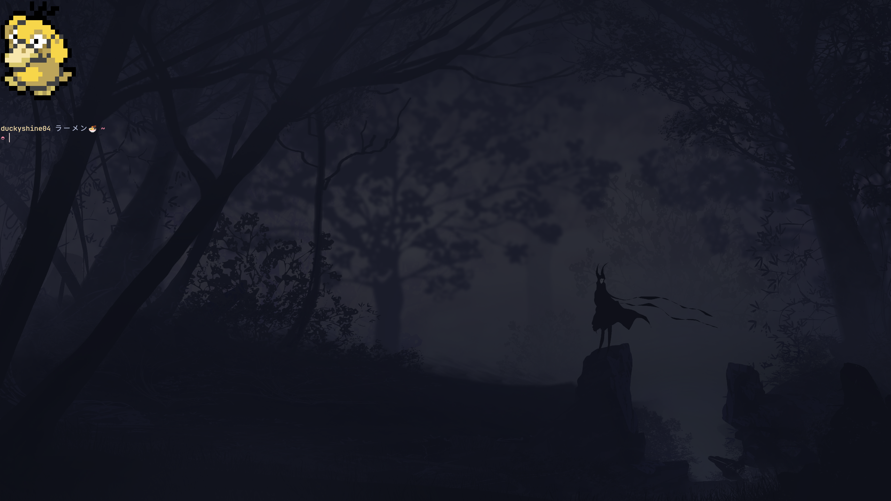

# duck-kitty
duck-kitty is my personal kitty configuration.

## Table of Contents
- [Getting Started](#getting-started)
    - [Installation](#installation)
- [Plugins](#plugins)
- [Screenshots](#screenshots)


## Getting Started
This section will guide you through installing **duck-kitty**.

### Installation
Clone the repository using the following command:

```sh
# Make .config directory if your system doesn't already have one
mkdir -p $HOME/.config

# Remove the existing kitty configuration
rm -rf $HOME/.config/kitty

# Clone my repo
git clone https://github.com/DuckyShine004/duck-kitty.git $HOME/.config/kitty
```

> [!Warning]
> If you already have a kitty setup, make sure to back it up before proceeding further.

## Snapshots

